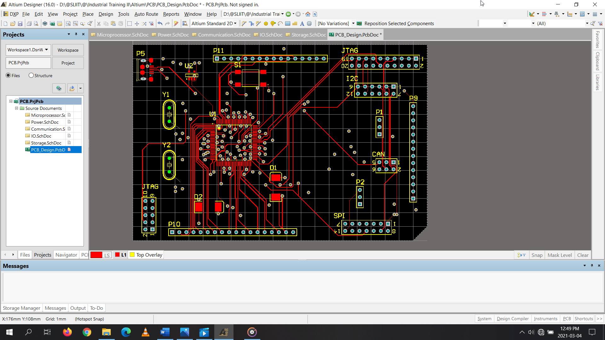
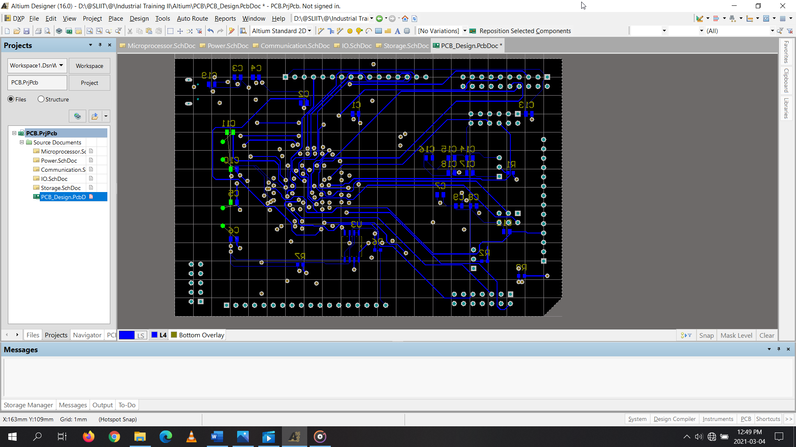
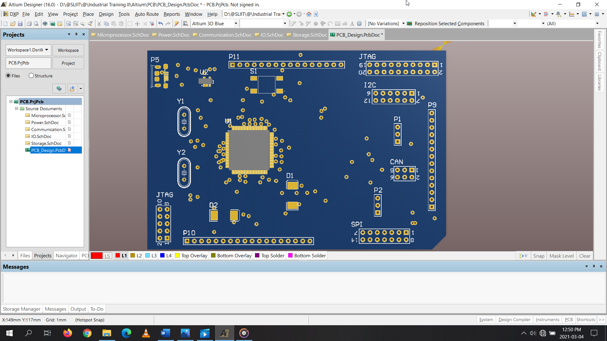

# STM32F407 ARM Processor-based Hardware Interface Module Designing

This project involves designing a **4-layer PCB** for an **STM32F407 ARM-based hardware interface module** using **Altium Designer 16**. The work covers schematic creation, custom component library development, PCB layout, and manufacturing file generation.

---

## 📌 Features
- **Microcontroller:** STM32F407 (LQFP100 package)
- **PCB Type:** 4-layer board
- **Design Software:** Altium Designer 16
- **Approach:** Hierarchical *Flat Design* using multi-sheet schematics
- **Interfaces Included:**
  - JTAG (Joint Test Action Group)
  - USB (Universal Serial Bus)
- **Custom Libraries:** Created schematic symbols & footprints for unavailable components

---

## 🛠 Design Process
1. **Research & Preparation**
   - Studied multilayer PCB concepts, THM vs SMT, EMC, and PCB testing methods
   - Reviewed STM32F407 datasheet, identified pin configurations & peripheral requirements

2. **Schematic Design**
   - Created separate schematic sheets for power, communication, and microcontroller configurations
   - Added JTAG, USB, voltage regulator, and crystal oscillator circuits
   - Used custom libraries for missing components

3. **PCB Layout**
   - Defined board shape and set 4-layer stackup
   - Placed components on both sides of PCB
   - Adjusted routing widths for connectors

4. **Manufacturing Output**
   - Generated assembly drawings, drill files, and 3D views

---

## 📸 Images

**Top View**  

**Bottom View**  

**3D View**  

---

## 🛠 Tools & Software Used
- PCB Designing Software: **Altium Designer 16**

---

## 📜 License
This project is shared for educational purposes. Please give credit if you use it.

---

## 📬 Contact
If you have feedback or suggestions, feel free to [open an issue](https://github.com).

---
